# Contenedores en red y Docker Desktop

> **Documento realizado por Roberto Delgado Sánchez - Alumno de Despliegue de Aplicaciones Web - DAW**

[TOC]

## 1. Enunciado

En este ejercicio vamos a crear dos contenedores, uno a partir de una imagen de **mariaDB** y otro a partir de una imagen de **Adminer** o **phpMyAdmin** (hay que elegir una). El objetivo final es conectar ambos contenedores en red y acceder desde el segundo al primero.

Es obligatorio el empleo de **Docker** **Desktop** para la resolución del ejercicio, así como la instalación de un par de extensiones (**PortNavigator** y **Disk** **Usage**) en dicha aplicación. Se incluirán en esta documentación capturas de pantalla y los datos que se consideren oportunos respecto al proceso seguido.

## 2. Creación de la red bridge

El primer paso es entrar en **Docker** **Desktop** e instalar la extensión **PortNavigator**, que usaremos para crear y gestionar redes:

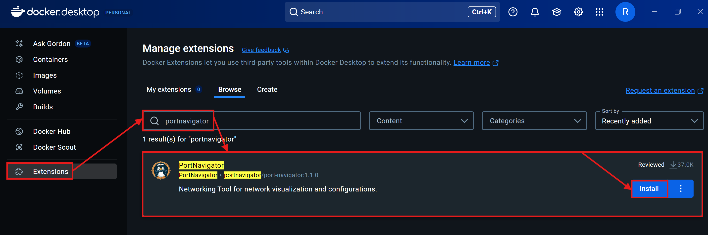

Una vez instalada nos aparecerá su icono:

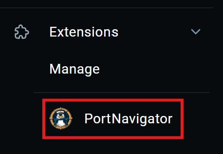

Y si hacemos clic en el mismo accederemos al menú de configuración de redes, donde podemos ver las redes que **Docker** tiene creadas por defecto:

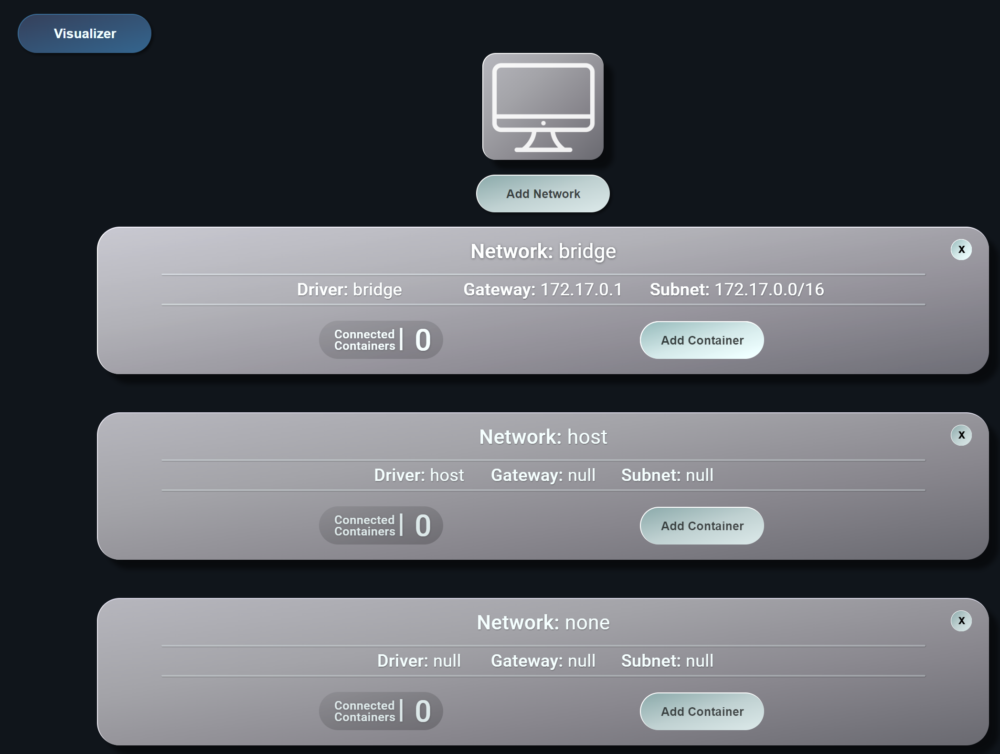

Para crear una red hacemos clic en el botón **Add Network** y rellenamos los parámetros necesarios (sólo se nos indica el nombre de la red, que debe ser `redej1`):

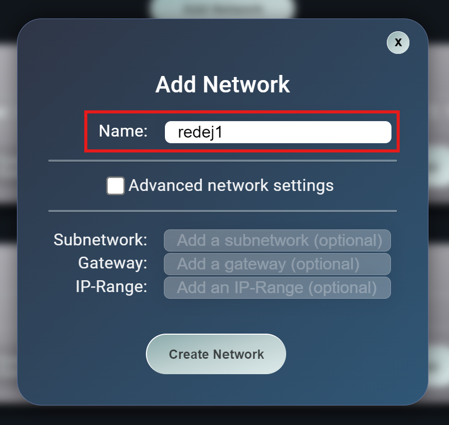

Los parámetros de la red que hemos creado (nombre, tipo de red, puerta de enlace y dirección de red) son los siguientes:

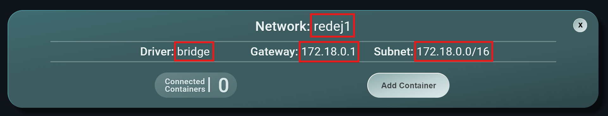

Ya tenemos creada la red.

## 3. Creación de un contenedor con imagen de mariaDB

Para crear un contenedor a partir de una imagen basada en **mariaDB**, lo primero que tenemos que hacer es buscar una imagen oficial de **mariaDB** en **Docker** **Desktop**, usando para ello el buscador y descargándola con el botón **Pull**:

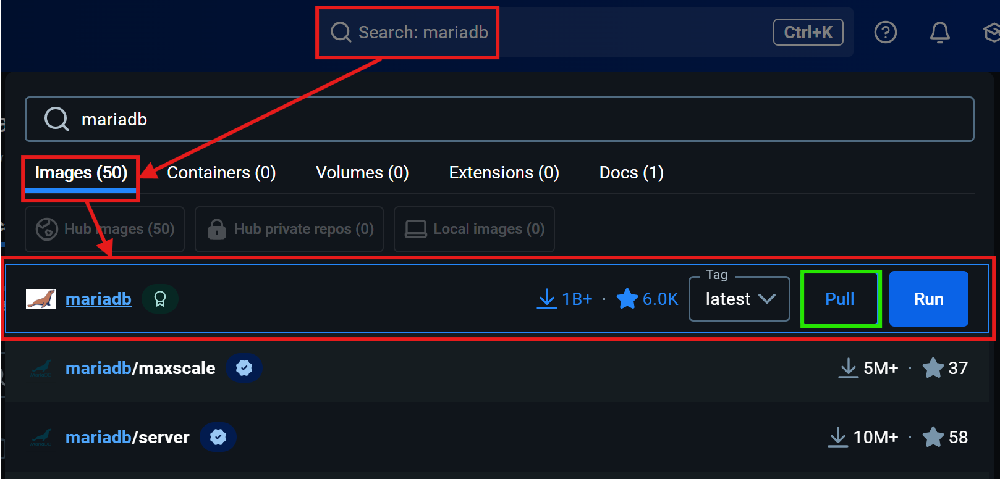

Una vez descargada la imagen, la tendremos disponible en el listado de imágenes. Para crear el contenedor sólo tenemos que hacer clic en el icono con forma de triángulo marcado en verde en la imagen siguiente, que es el equivalente al comando `docker run` de la línea de comandos:

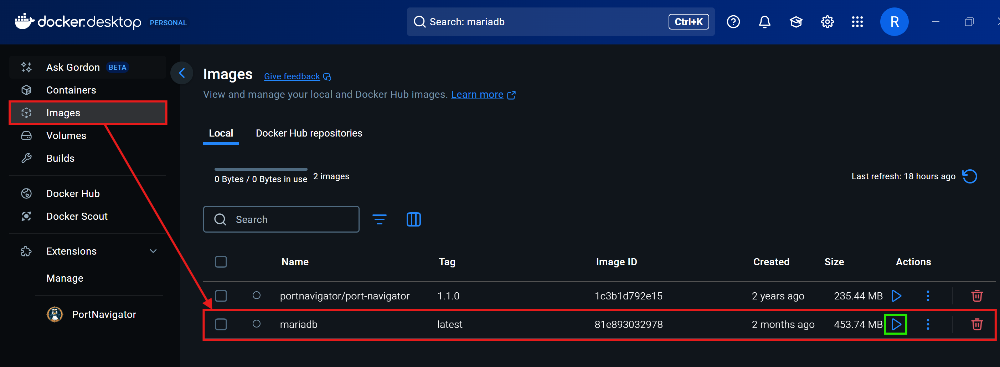

Cuando pulsamos dicho botón, nos aparece una ventana en la que podemos configurar diversos parámetros de nuestro contenedor. Aquí tenemos que incluir los datos aportados por el enunciado del ejercicio:

- **nombre del contenedor**: no se especifica ninguno, así que uso una combinación del nombre de la imagen, mi nombre de usuario en **educastur** y el número de ejercicio.
- **puerto**: debe ser accesible desde el puerto 3306.
- **variables de entorno**: según la documentación de la imagen de **mariaDB**, cuando creamos un contenedor a partir de la misma podemos definir diversos parámetros mediante este tipo de variables, como por ejemplo la contraseña del usuario root (`MARIADB_ROOT_PASSWORD`), crear un usuario (`MARIADB_USER`), su contraseña (`MARIADB_PASSWORD`) y una base de datos por defecto (`MARIADB_DATABASE`), que en nuestro caso debe llamarse `DAW`. El resto de datos se escogen al azar, siendo el usuario una combinación de mi nombre y apellidos. 

Estas opciones quedan tal y como se puede ver en la siguiente imagen:

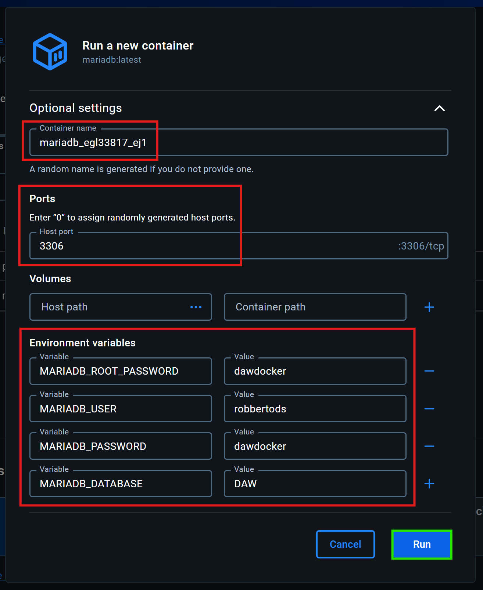

Al hacer clic en el botón **Run** se crea el contenedor (en la siguiente imagen se puede ver parte del log donde se recoge el proceso de instalación y se pueden ver cosas como el nombre del contenedor o la creación del usuario y de la base de datos por defecto):

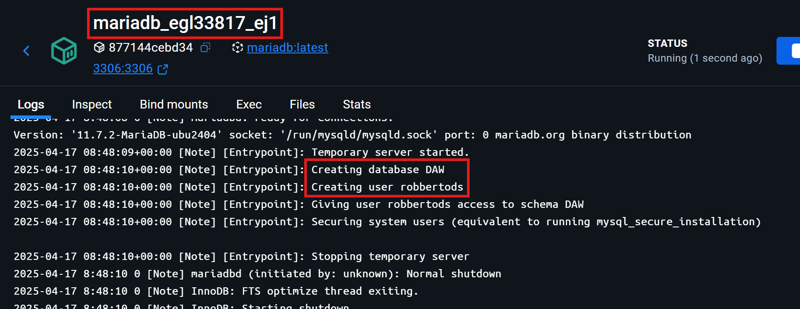

Ahí tenemos nuestro contenedor creado y en funcionamiento:

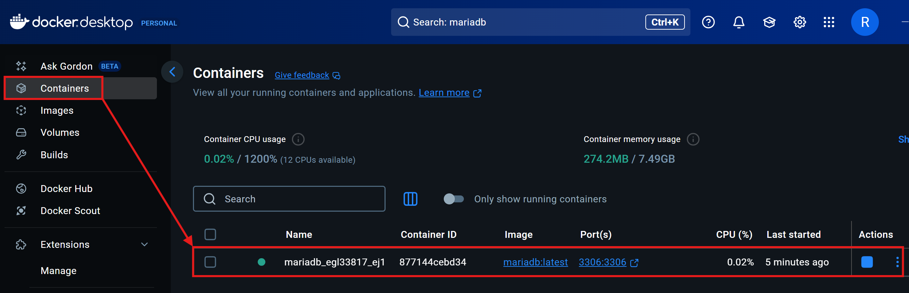

Sólo quedaría pendiente conectar el contenedor que acabamos de crear a la red `redej1`. Para ello, tenemos en primer lugar que desconectar el contenedor de la red bridge que **Docker** crea por defecto, y después conectarlo a nuestra red `redej1`. Los pasos se pueden ver a continuación:

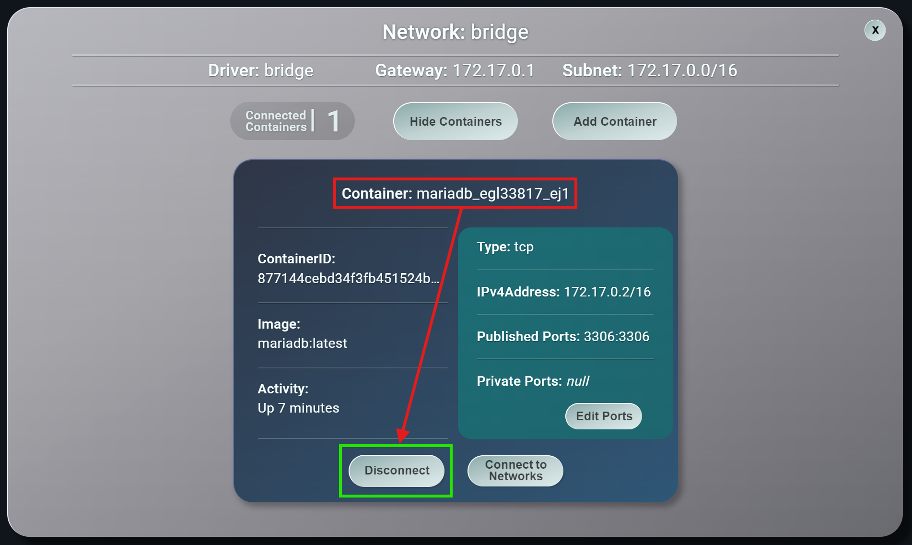

Al desconectarlo, queda asignado automáticamente a una red sin nombre, desde la cual lo podemos conectar a la red que hemos creado `redej1`:

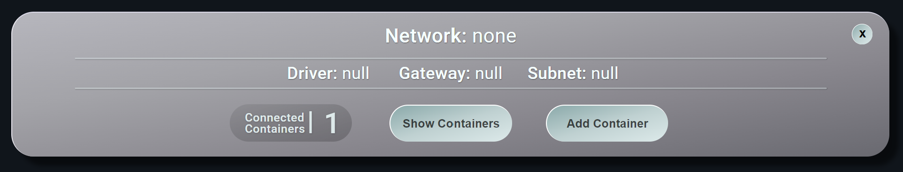

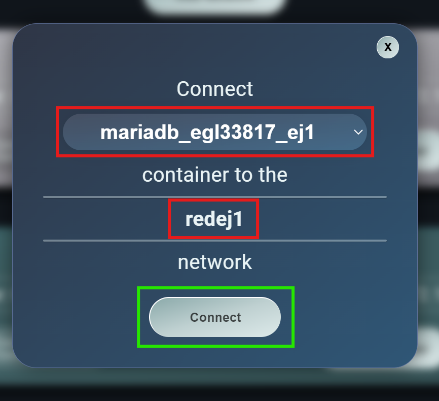

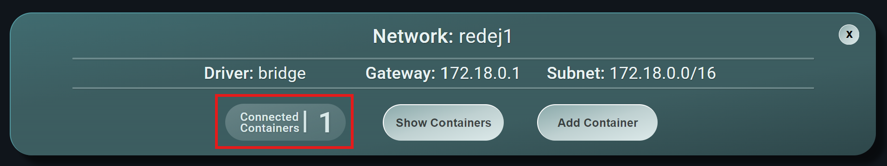

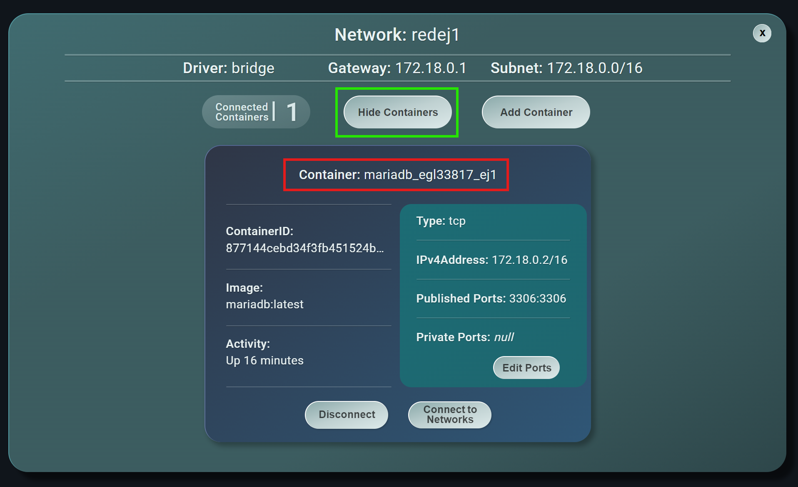

Ya tenemos creado el contenedor basado en la imagen de **mariaDB**. Ahora hay que generar un script **SQL** que cree una tabla de nombre módulos con algunos registros, como los nombres de las asignaturas en las que estoy matriculado:

```sql
CREATE TABLE modulos
(
	id INT AUTO_INCREMENT PRIMARY KEY,
	nombreModulo VARCHAR(60) NOT NULL
);

INSERT INTO modulos (nombre) VALUES
('bases de datos'),
('programación'),
('interfaces'),
('despliegue'),
('cliente'),
('servidor');
```

De momento lo dejamos así, ya que este script se usará más adelante.

## 4. Creación de un contenedor con Adminer o phpMyAdmin

De las dos opciones que se nos dan escogemos **Adminer** para crear otro contenedor. Los pasos son similares a los que seguimos para crear el contenedor basado en **mariaDB**, por lo que mostraremos las capturas de pantalla del proceso haciendo sólo hincapié en aquello que sea diferente:

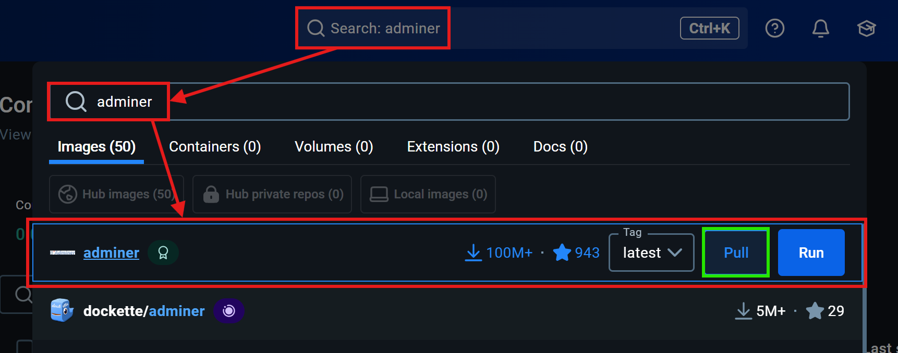

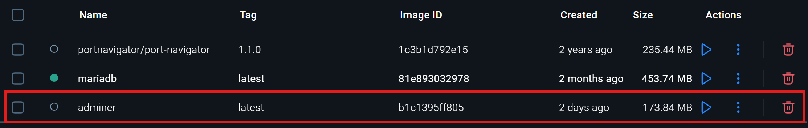

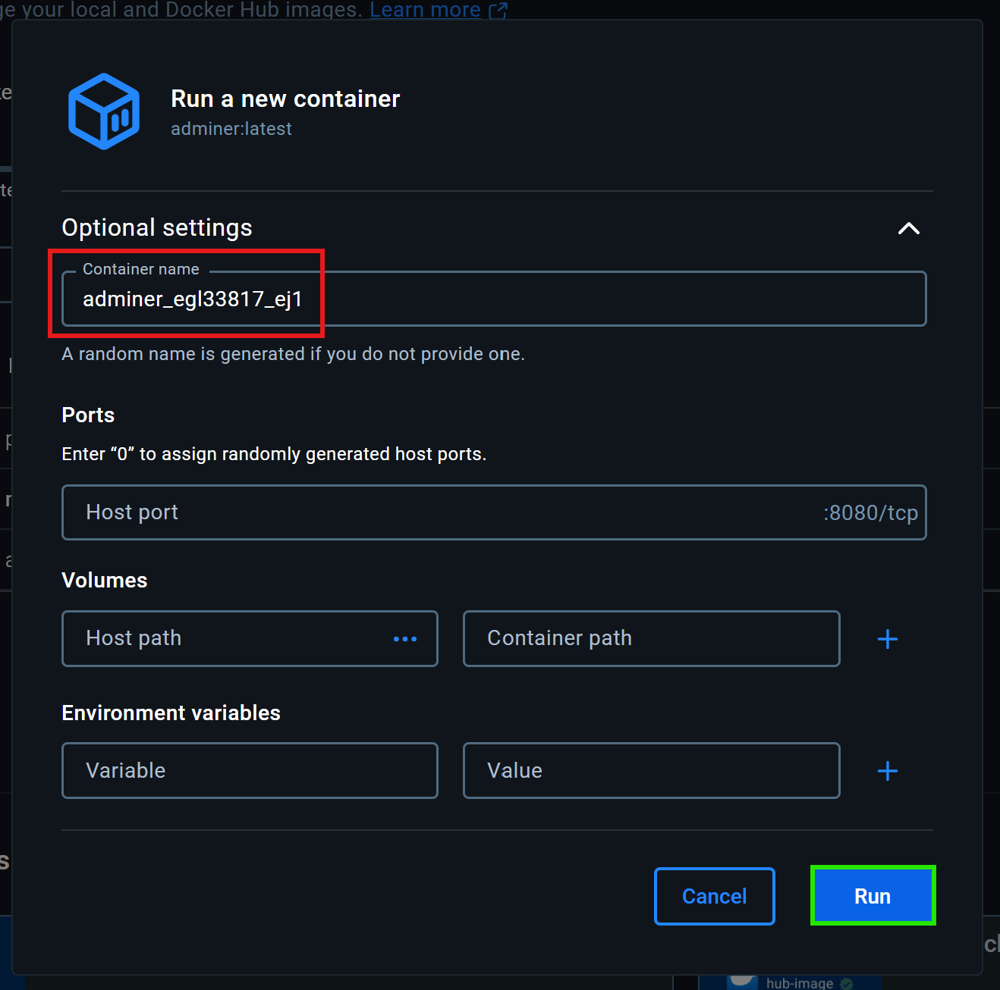


Nuestros dos contenedores ya están en marcha:

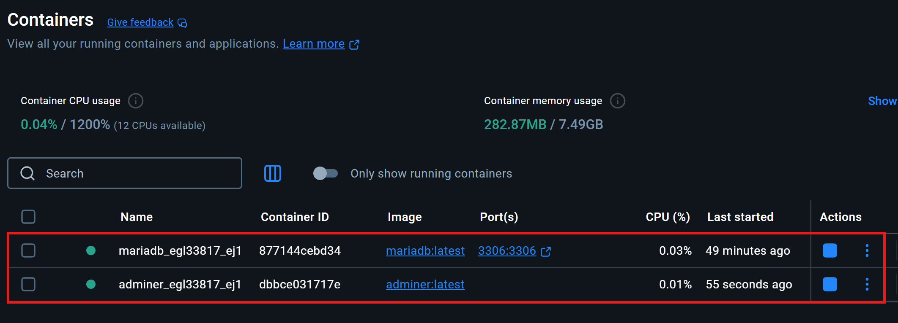

Metemos al contenedor creado con la imagen de **Adminer** en la red `redej1`:

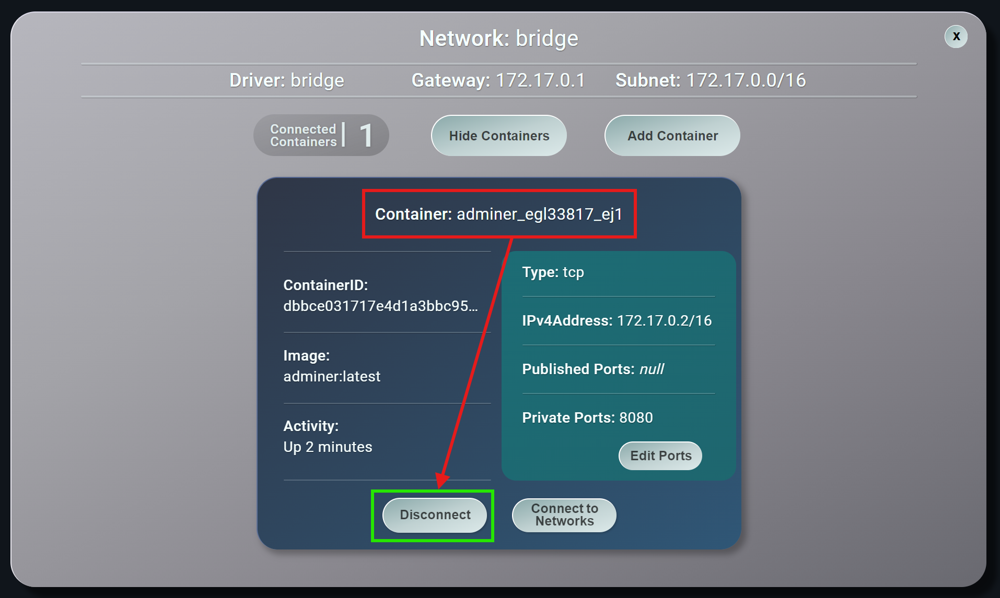

Al desconectarlo, queda asignado automáticamente a una red sin nombre, desde la cual lo podemos conectar a la red que hemos creado `redej1`:


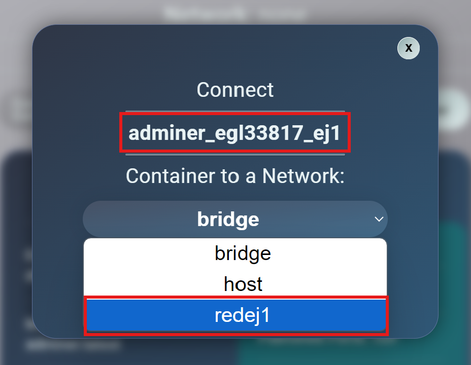

Ya tenemos a ambos contenedores conectados a nuestra red `redej1`:

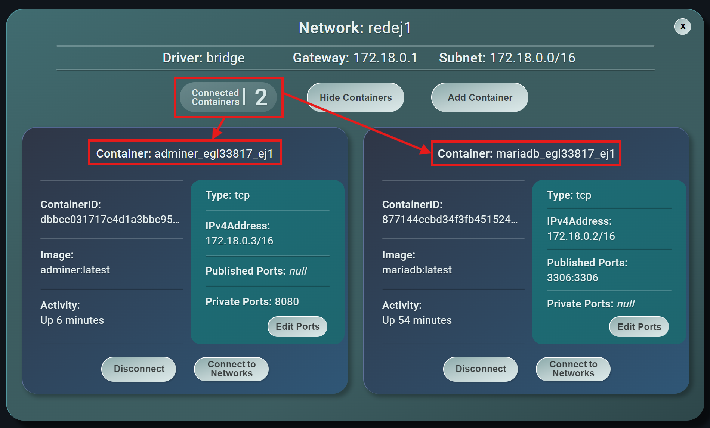

## 5. Instalación y uso de la Disk Usage
