# Docker Compose

> **Documento realizado por Roberto Delgado Sánchez - Alumno de Despliegue de Aplicaciones Web - DAW**

[TOC]

## 1. Enunciado

En este ejercicio vamos a trabajar con **FileBrowser**, aplicación de código abierto que permite administrar y compartir archivos desde un navegador web de forma sencilla y segura, es decir, que sirve para crear una nube particular. Proporciona una interfaz intuitiva que soporta tareas como subir, descargar, mover, copiar, renombrar y borrar ficheros y carpetas.

Asimismo, incluye características avanzadas como al edición de archivos de texto en el navegador, la creación de enlaces compartidos con configuraciones personalizables y la configuración de permisos de acceso para varios usuarios.

Es compatible con múltiples sistemas operativos y puede integrarse en entornos como servidores domésticos, servicios en la nube o contenedores Docker, ofreciendo flexibilidad para distintos usos.

El proyecto está alojado en https://hub.docker.com/r/hurlenko/filebrowser.


## 2. Despliegue del contenedor

Para poder desplegar esta aplicación debemos crear un archivo `docker-compose.yaml` con el siguiente contenido, creado a partir del modelo básico que se muestra en la web del proyecto:

- `image`: imagen de partida para crear el contenedor que permitirá ejecutar la aplicación.
- `container_name`: nombre que queremos reciba el contenedor.
- `ports`: puerto en el que "escuchará" las peticiones esta aplicación.
- `volumes`: carpetas del host local en las que se guardarán los datos (usamos `bind-mount`).
- `restart`: el contenedor se reinicia al detener su ejecución salvo que lo detenga un administrador.

```yaml
services:
  filebrowser:
    image: hurlenko/filebrowser:latest
    container_name: filebrowser_ej2
    ports:
      - "8080:8080"
    volumes:
      - ./fb-data:/data
      - ./fb-config:/config
    restart: unless-stopped    
```

Copiamos este archivo `docker-compose.yaml` en la carpeta del `ejercicio2` y ejecutamos este comando para crear el contenedor aprovechando la aplicación **Git** **Bash**:

```bash
$ docker compose up -d
```


Resulta curioso que, a pesar de que aparece en el archivo `yaml` de ejemplo en la web del proyecto, al crear el contenedor nos diga que el parámetro `version` está obsoleto, por lo que aunque aparezca en la imagen de este archivo en la versión final se elimina.


Una vez creado y puesto en marcha el contenedor podemos ver que se han creado las dos carpetas que van a almacenar los datos: `fb-data` y `fb-config`.


Asimismo, por razones desconocidas, en **Docker Desktop** el contenedor aparece con el nombre `ejercicio2`, mientras que si ejecutamos el comando `docker ps` para saber qué contenedores están en ejecución sí que aparece con el nombre definido en el archivo `yaml`, `filebrowser_ej2`:


## 3. Probando la aplicación

Para comprobar que ya tenemos **FileBrowser** funcionando correctamente sólo tenemos que abrir una ventana del navegador y conectarnos a http://localhost:8080:


Entramos con los datos proporcionados (**admin/admin**):

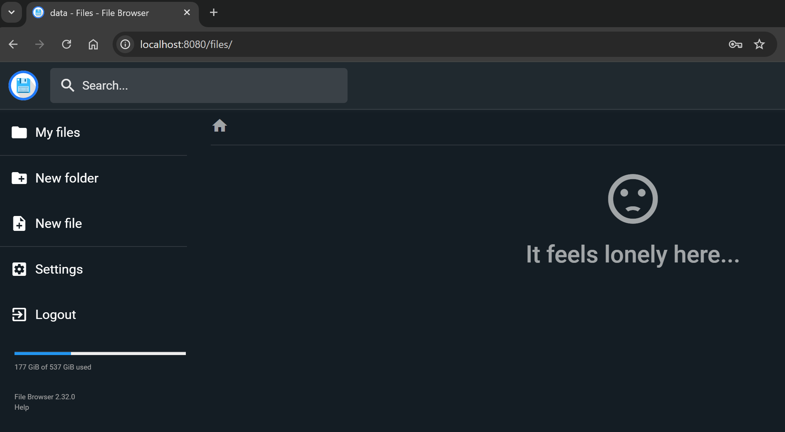

Cambiamos el idioma de la aplicación a `español`:

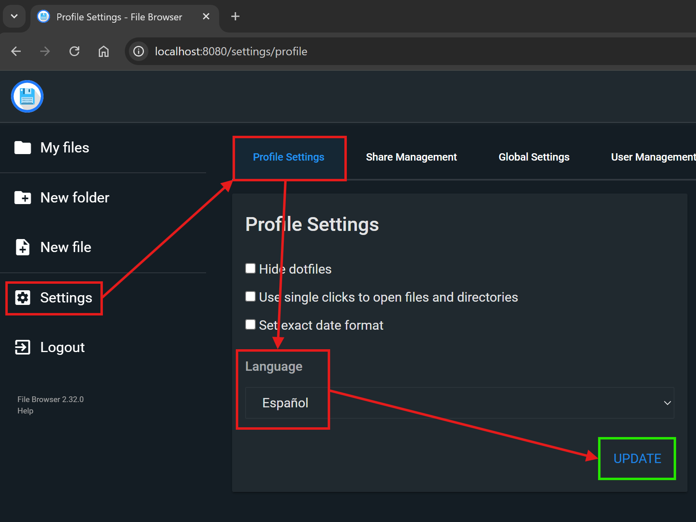

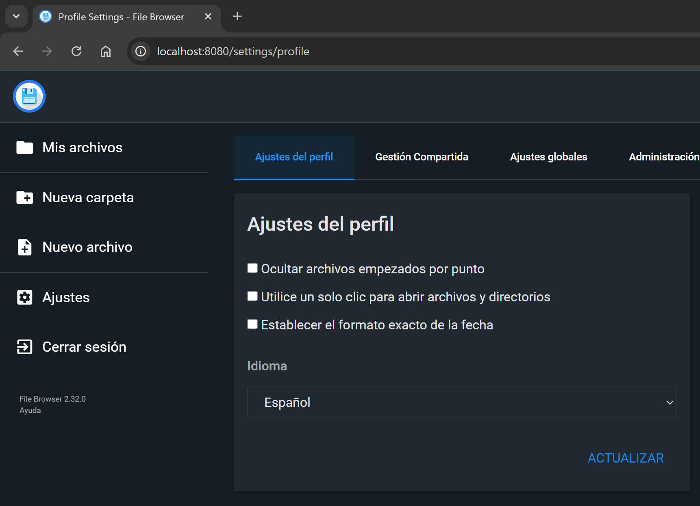

Creamos un archivo de texto (en la carpeta `fb-data` no hay nada todavía):

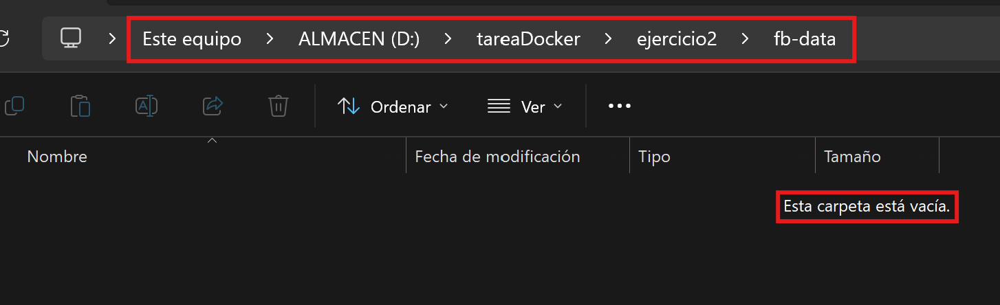

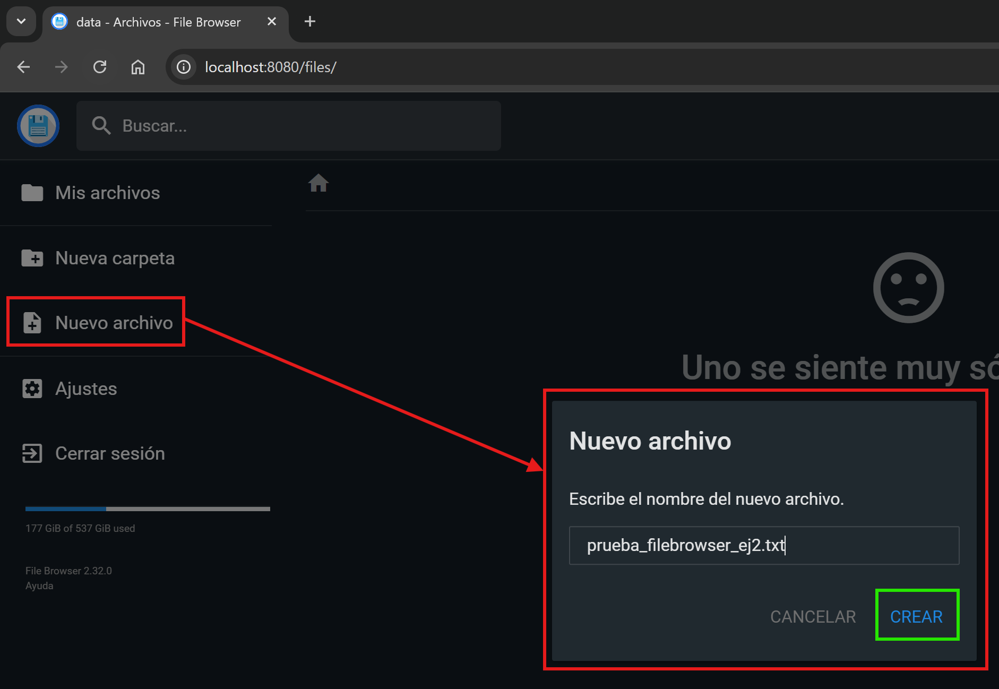

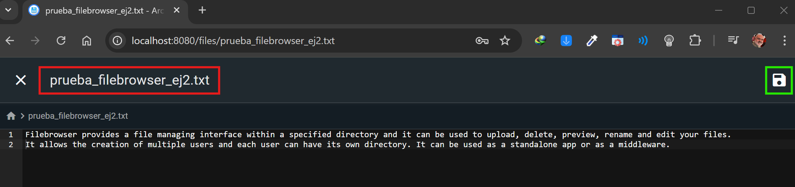

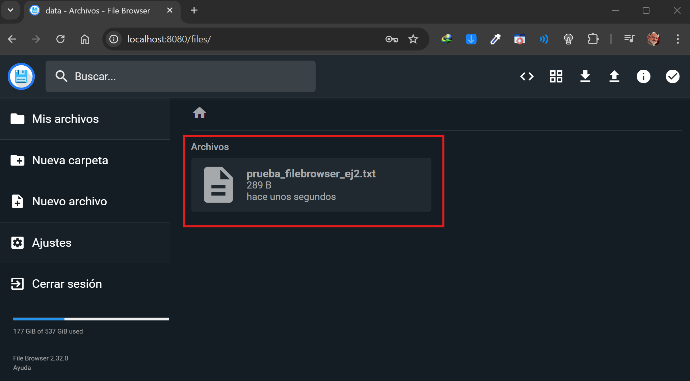

Si ahora vamos a la carpeta `fb-data` vemos que se ha creado ese archivo:

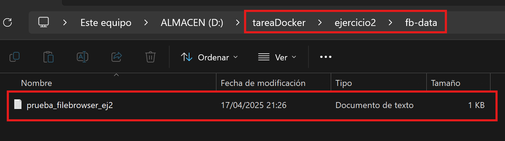

En la carpeta `fb-config` se ha creado automáticamente un archivo de nombre`filebrowser.db` imagino que con parámetros de configuración de la aplicación:

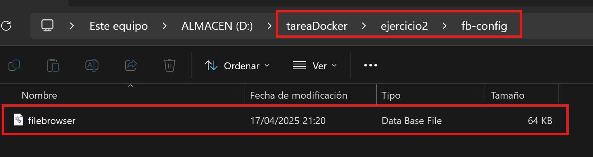

Vamos a subir un archivo a **FileBrowser**:

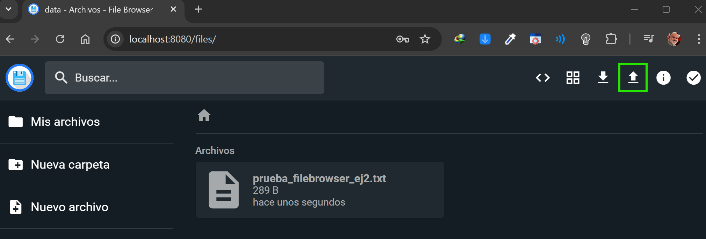

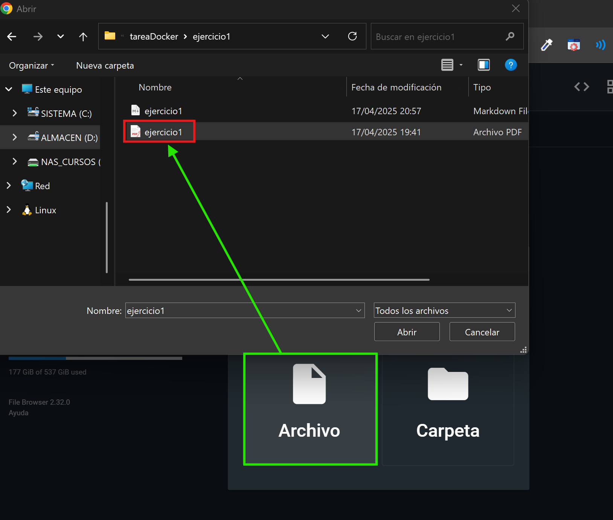

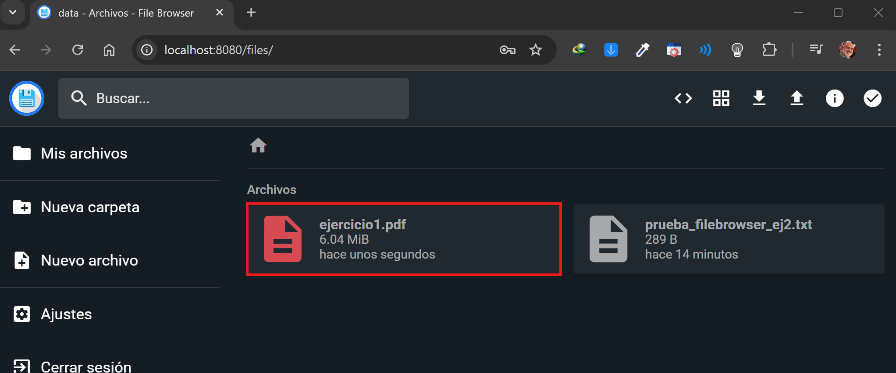

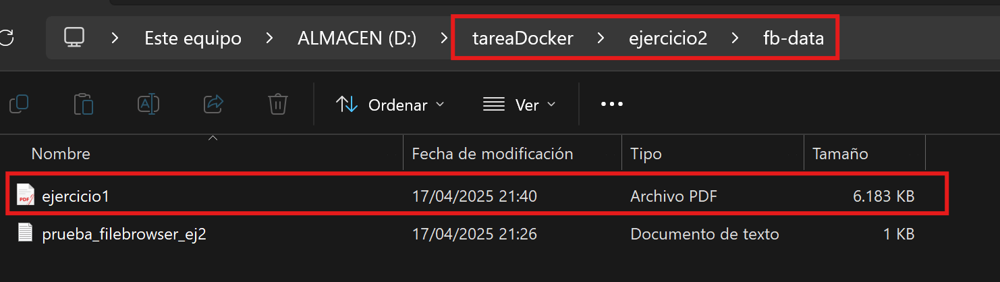

Y con esto finaliza la realización de este segundo ejercicio.