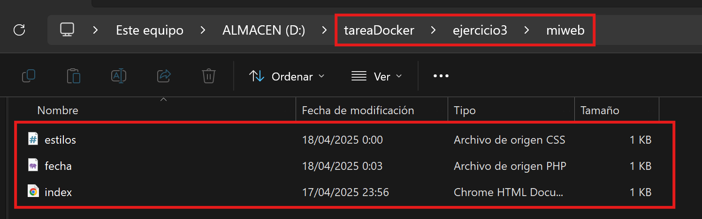
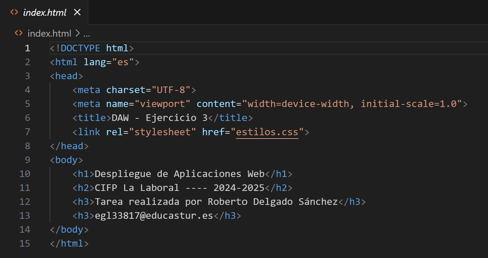
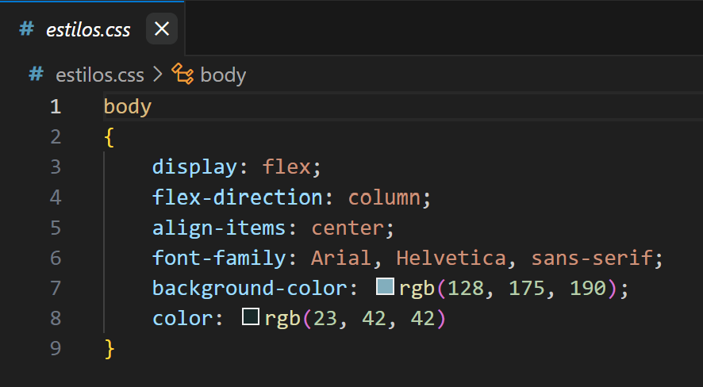
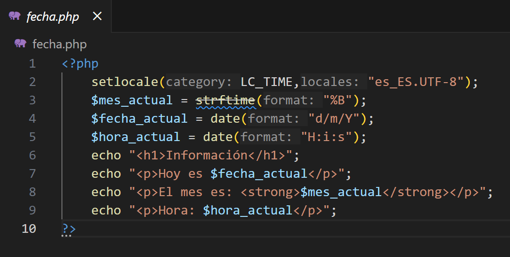
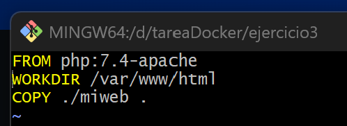
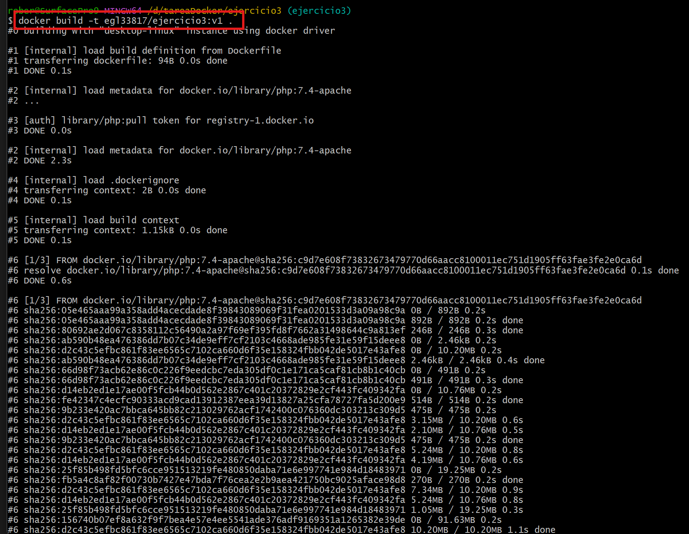
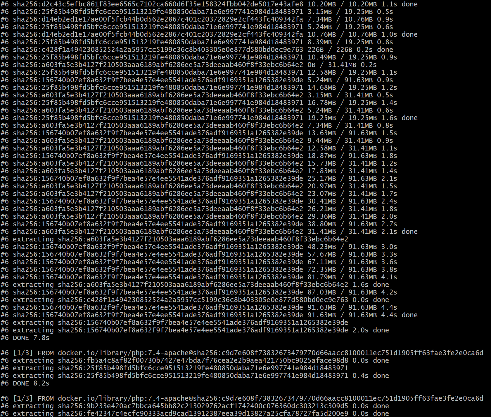
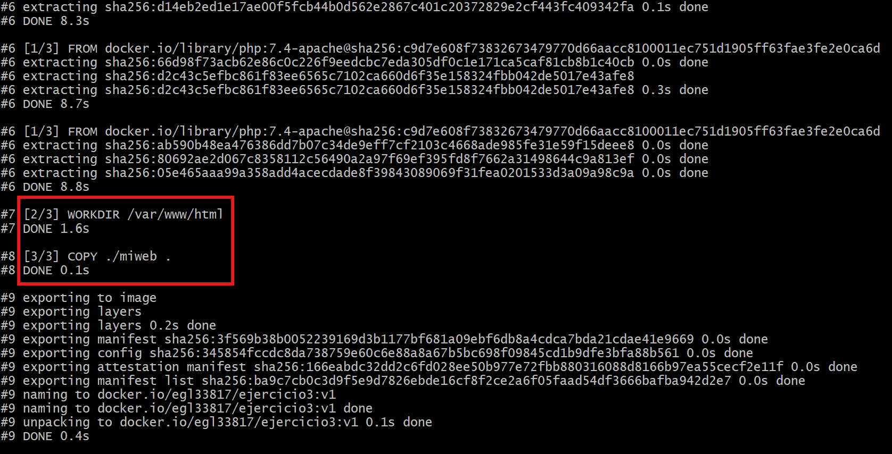
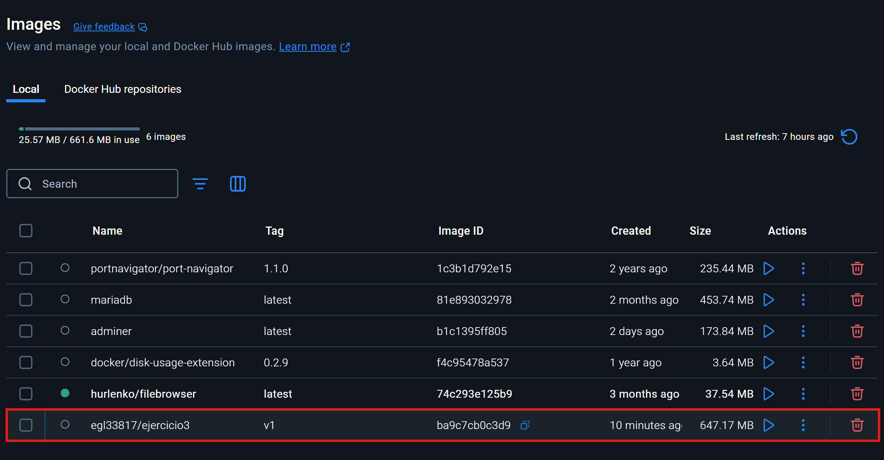

# Imagen con Dockerfile y aplicación web

> **Documento realizado por Roberto Delgado Sánchez - Alumno de Despliegue de Aplicaciones Web - DAW**

[TOC]

## 1. Enunciado

En este ejercicio vamos a abordar la creación de una imagen con `Dockerfile`, fichero de **Docker** que nos permite crear una imagen a partir de otra ya creada y modificarla a nuestro gusto con el objetivo de que pueda ser redistribuida posteriormente. 

En nuestro caso partiremos de la imagen `php:7.4-apache` a la que le añadiremos un sitio web y un script **PHP** para posteriormente crear otra imagen que subiremos a nuestra cuenta de **Docker** **Hub**.

## 2. Creación de la web

Se nos pide que creemos un sitio web sencillo en el que figure nuestro nombre y que debe constar al menos de un archivo `index.html` y de una hoja de estilos. Ambos ficheros los crearemos dentro de una carpeta que se llamará `miweb`:









## 3. Creación del fichero Dockerfile y de la imagen

El contenido del fichero `Dockerfile` es el siguiente:

- `FROM`: imagen que usaremos como base para crear la nuestra (`php:7.4-apache` en nuestro caso).
- `WORKDIR`: nos movemos al directorio `/var/www/html`.
- `COPY`: copiamos el contenido de la carpeta `miweb` en el directorio al que nos movimos antes.



Para crear la imagen deseada a partir del fichero `Dockerfile` antes citado usamos el siguiente comando:

```bash
$ docker built -t egl33817/ejercicio3:v1 .
```

significando cada elemento del mismo lo siguiente:

- `docker build`: comando para crear una imagen a partir de lo especificado en un archivo `Dockerfile`.
- `-t`: opción para darle un nombre a la imagen que vamos a crear.
- `egl33817/ejercicio3`: el nombre de la imagen.
- `v1`: versión de la imagen.
- `.`: ruta en la que están tanto el archivo `Dockerfile` como los archivos necesarios para construir la imagen, es decir, lo que se conoce como contexto en el mundo **Docker**. El punto hace referencia a la carpeta actual.

El resultado de la ejecución de este comando se puede ver a continuación:







En la última imagen podemos ver el detalle de la ejecución de las instrucciones que habíamos definido en el archivo `Dockerfile`.

Si ahora nos vamos al **Docker Desktop**, podemos ver que tenemos una nueva imagen cuyo nombre es el que pusimos en el comando `docker build`:



## 4. Creación de un contenedor a partir de la imagen generada

Vamos a probar la 