# Imagen con Dockerfile y aplicación web

> **Documento realizado por Roberto Delgado Sánchez - Alumno de Despliegue de Aplicaciones Web - DAW**

[TOC]

## 1. Enunciado

En este ejercicio vamos a abordar la creación de una imagen con `Dockerfile`, fichero de **Docker** que nos permite crear una imagen a partir de otra ya creada y modificarla a nuestro gusto con el objetivo de que pueda ser redistribuida posteriormente. 

En nuestro caso partiremos de la imagen `php:7.4-apache` a la que le añadiremos un sitio web y un script **PHP** para posteriormente crear otra imagen que subiremos a nuestra cuenta de **Docker** **Hub**.

## 2. Creación de la web

Se nos pide que creemos un sitio web sencillo en el que figure nuestro nombre y que debe constar al menos de un archivo `index.html` y de una hoja de estilos. Ambos ficheros los crearemos dentro de una carpeta que se llamará `miweb`:


## 3. Creación del fichero Dockerfile y de la imagen

El contenido del fichero `Dockerfile` es el siguiente:

- `FROM`: imagen que usaremos como base para crear la nuestra (`php:7.4-apache` en nuestro caso).
- `WORKDIR`: nos movemos al directorio `/var/www/html`.
- `COPY`: copiamos el contenido de la carpeta `miweb` en el directorio al que nos movimos antes.


Para crear la imagen deseada a partir del fichero `Dockerfile` antes citado usamos el siguiente comando:

```bash
$ docker built -t egl33817/ejercicio3:v1 .
```

significando cada elemento del mismo lo siguiente:

- `docker build`: comando para crear una imagen a partir de lo especificado en un archivo `Dockerfile`.
- `-t`: opción para darle un nombre a la imagen que vamos a crear.
- `egl33817/ejercicio3`: el nombre de la imagen.
- `v1`: versión de la imagen.
- `.`: ruta en la que están tanto el archivo `Dockerfile` como los archivos necesarios para construir la imagen, es decir, lo que se conoce como contexto en el mundo **Docker**. El punto hace referencia a la carpeta actual.

El resultado de la ejecución de este comando se puede ver a continuación:


En la última imagen podemos ver el detalle de la ejecución de las instrucciones que habíamos definido en el archivo `Dockerfile`.

Si ahora nos vamos al **Docker Desktop**, podemos ver que tenemos una nueva imagen cuyo nombre es el que pusimos en el comando `docker build`:


## 4. Creación de un contenedor a partir de la imagen generada

Vamos a probar la imagen creada generando un contenedor a partir de la misma con los siguientes parámetros que se nos especifican en el enunciado del ejercicio:

- debe llamarse `ejercicio3`.
- debe ser accesible desde un navegador en el puerto `8000`.

Creamos el contenedor y lo ponemos en ejecución:

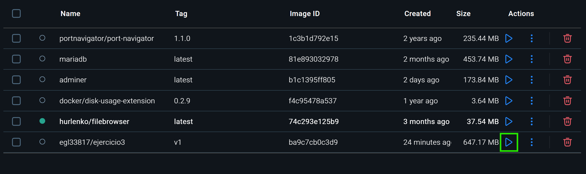

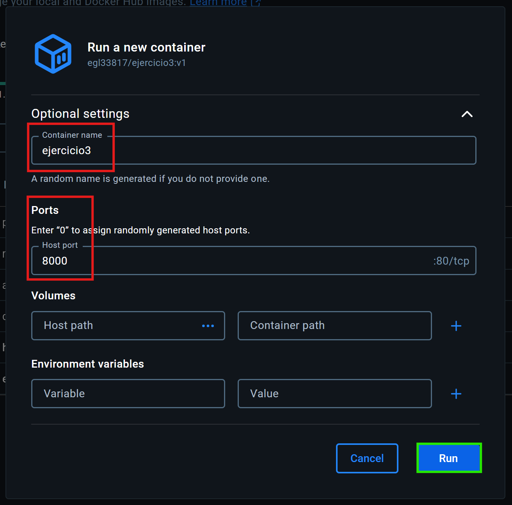

Una vez arrancado nos conectamos al mismo con un navegador:

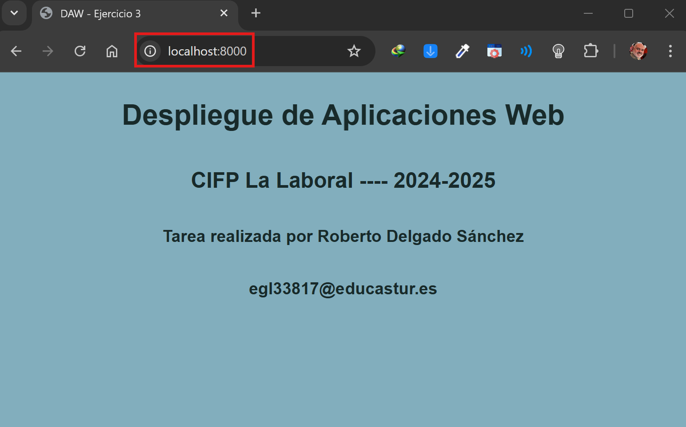

Y comprobamos que el script **PHP** se ejecuta correctamente:

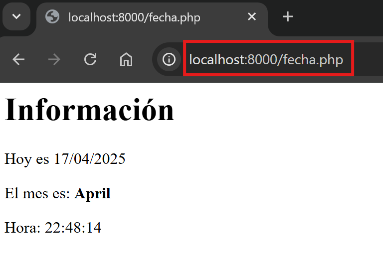

Una vez comprobado que el contenedor funciona lo borramos:

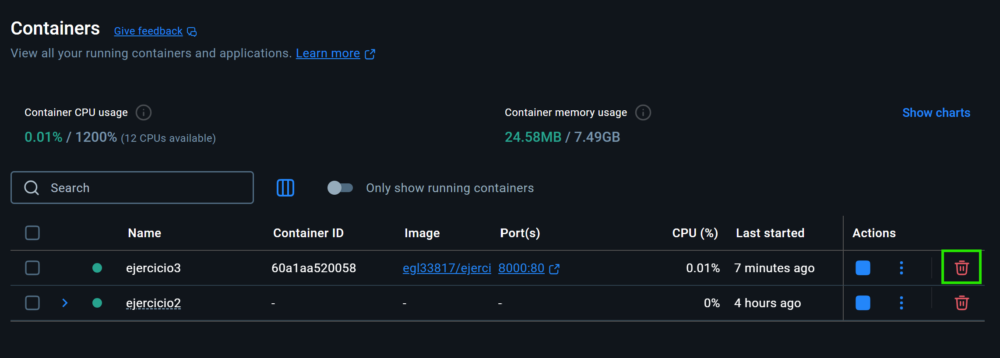

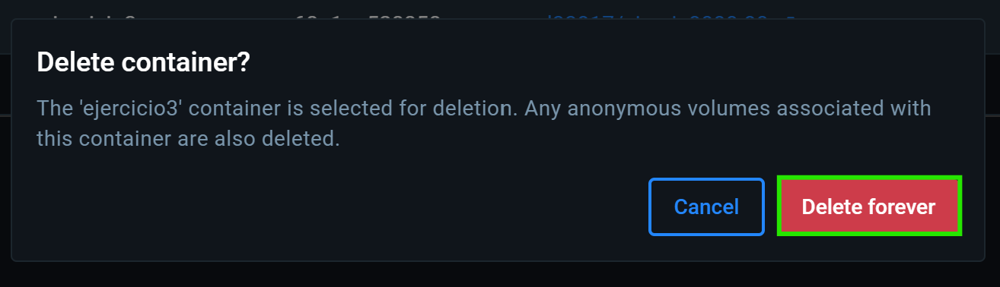

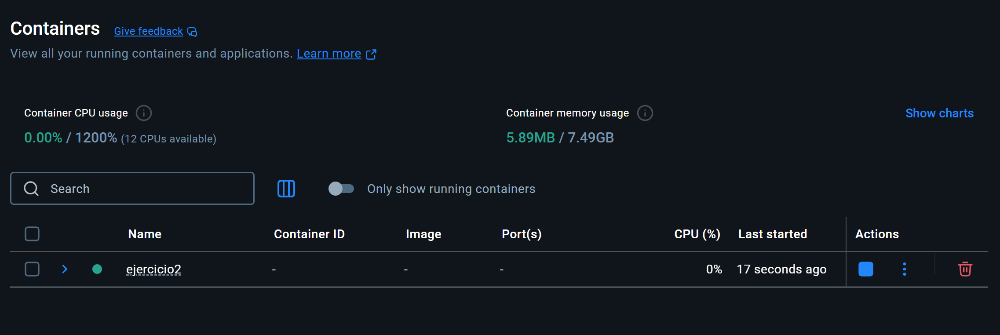

## 5. Subir la imagen a Docker Hub

Antes de subir la imagen al repositorio he tenido que añadir una etiqueta a la misma, ya que al subirla me daba un error de permisos. Los comandos utilizados para añadir esa etiqueta y subirla a **Docker Hub** son:

```bash
$ docker tag ba9c7cb0c3d9f5e9d7826ebde16cf8f2ce2a6f05faad54df3666bafba942d2e7 robbertods/ejercicio3:version1.0
$ docker push robbertods/ejercicio3:version1.0
```

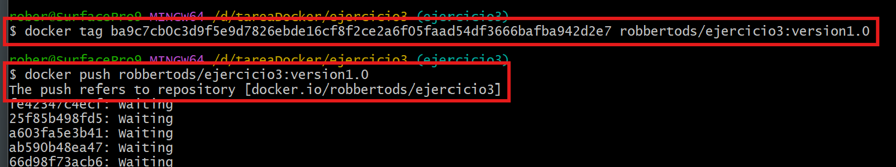

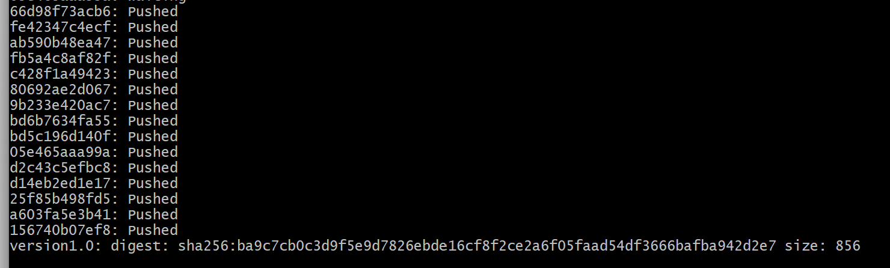

Una vez finalizado el proceso, podemos ver la imagen en nuestro repositorio personal:

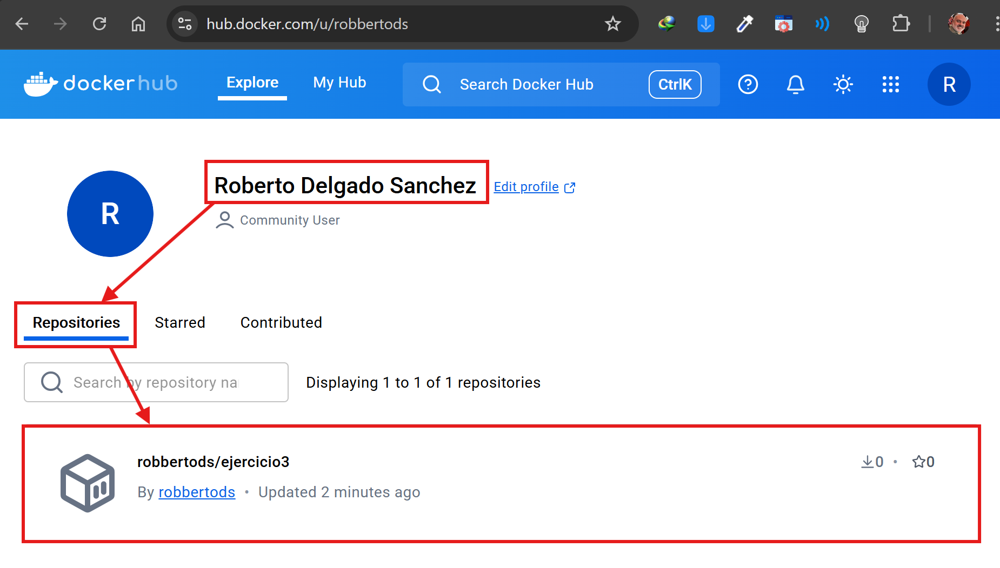

Ahora borramos la imagen que tenemos en nuestra máquina local desde **Docker Desktop**:

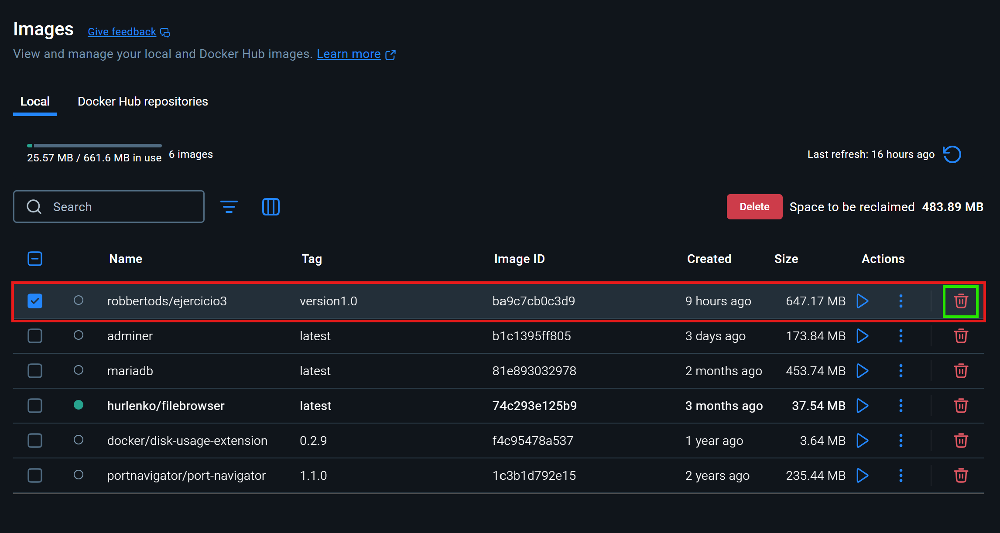

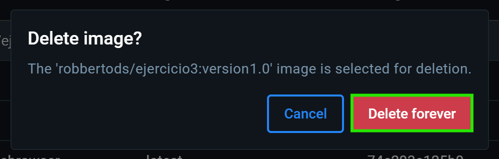

Comprobamos que ya no existe:

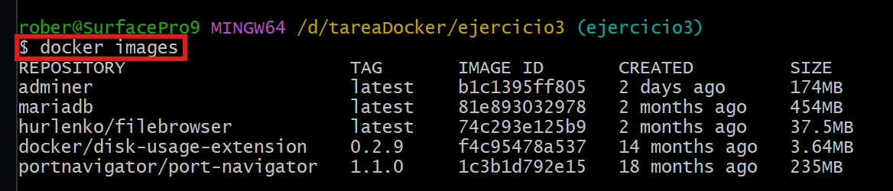

Y a continuación la descargamos desde Docker Desktop:

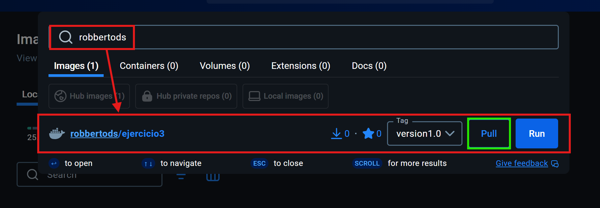

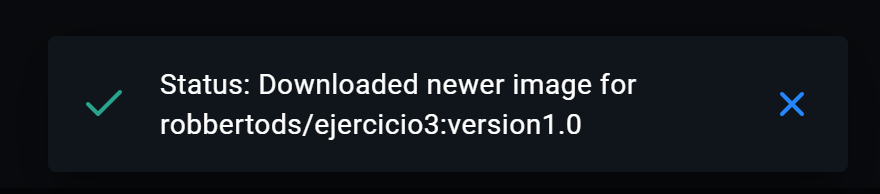

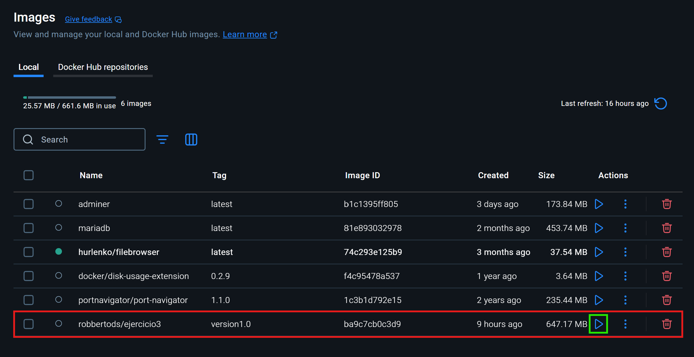

La ponemos en marcha en el puerto `9090` por ejemplo:

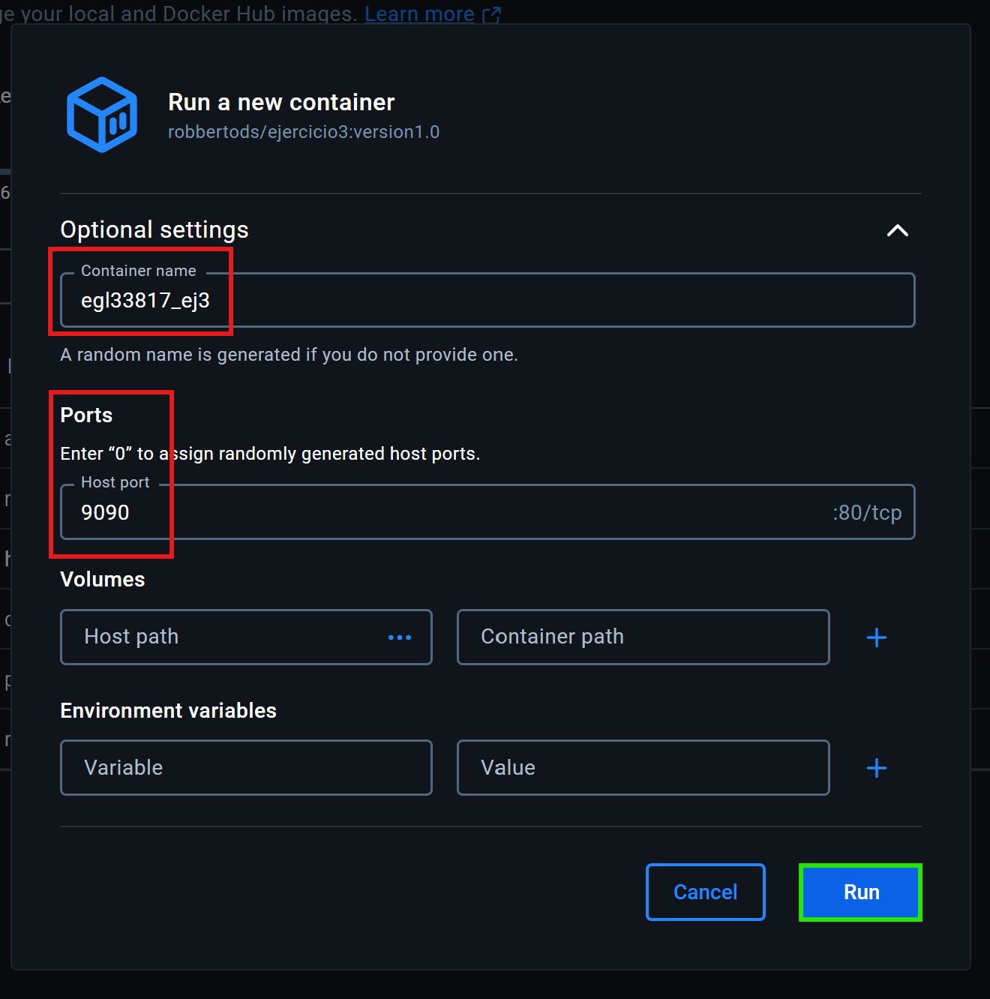

Y comprobamos que todo funciona correctamente:

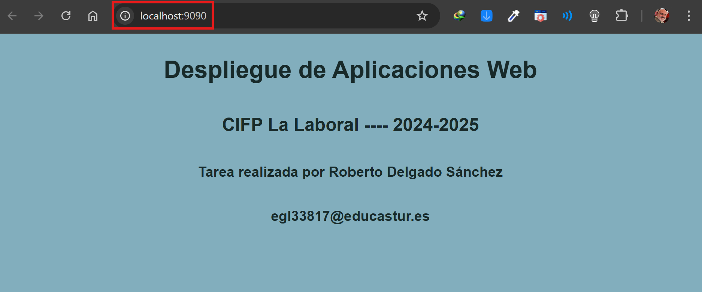

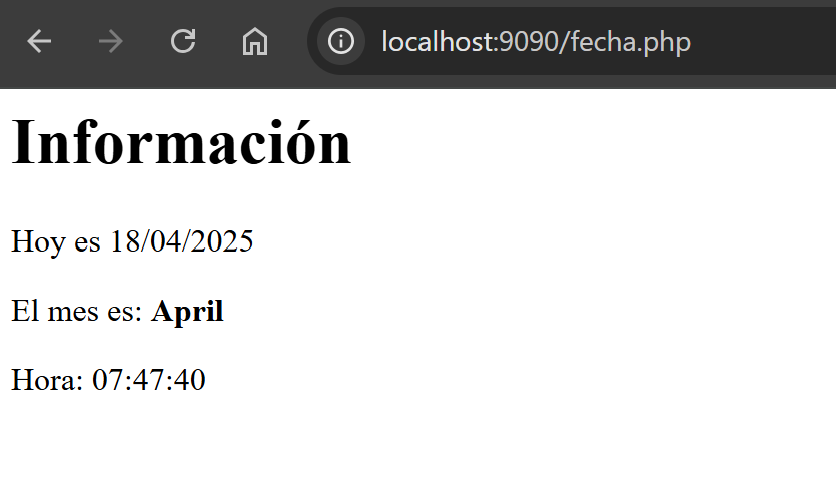

Y así finaliza este tercer y último ejercicio de esta práctica.